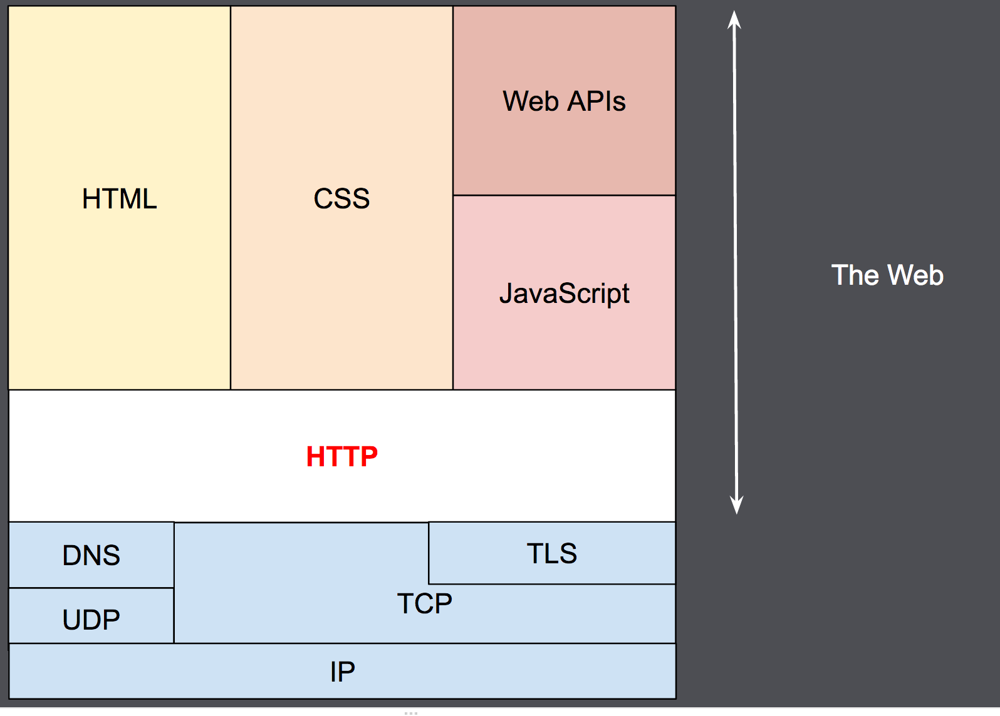
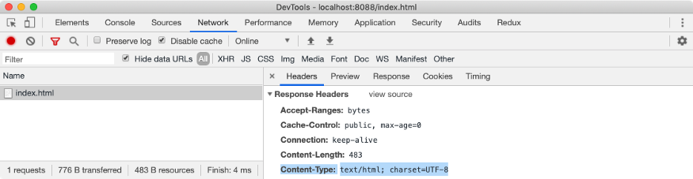
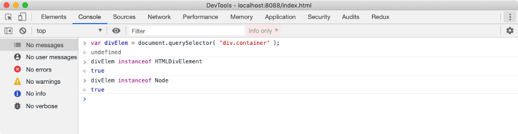
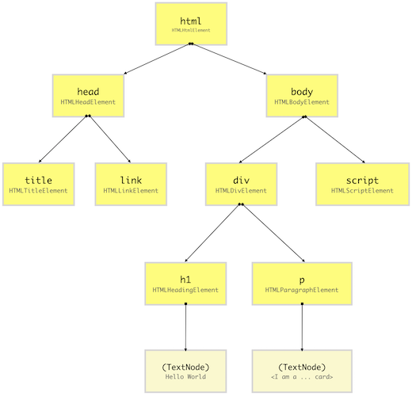
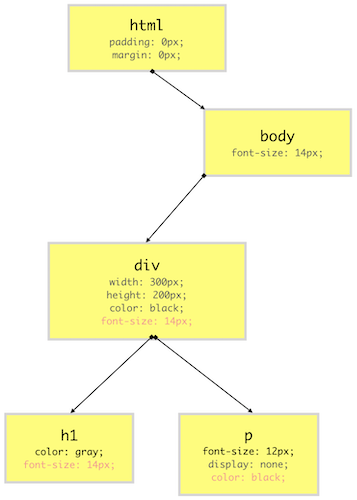
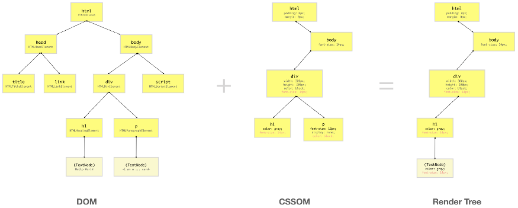

# _When a user enters an URL in the browser, how does the browser fetch the desired result ?_ #

**ACT - 1 Breaking of a URL**

**https://www.youtube.com/**

**What is https, www ?**

HTTP is a client-server protocol which fetches hypertext documents, images and videos, it can also post content to servers.

This protocol is built on top of TCP/IP,  in simple terms it sees if the data coming back is in HTML format.

HTML is the language of the Web, and HTTP is the grammar rules for using it. ‘S’ stands for secure. 

WWW is a combination of all resources and users on the Internet that are using HTTP.

**What is a domain (youtube.com)?**

Domain directs where to go, browser looks up the IP(Internet Protocol) of the entered domain name in  DNS (Domain Name System).

[Where are all the Internet domain names registered and maintained?](https://computer.howstuffworks.com/dns.htm)

**ACT - 2 Talking to the server **

Browser initiates a connection with the server located on that IP.

Browser sends an HTTP request to the server to request the contents of the page.

**Request**

The HTTP request contains a request line, headers (or metadata about the request), and a body. The request line contains information that the server can use to determine what the client (in this case, your browser) wants to do.

HTTP Get request example 

GET /hello-world/ HTTP/1.1

**Response **

The server takes the request and based on the info in the request line, headers, and body, decides how to process the request. For the request, GET /hello-world/ HTTP/1.1, the server gets the content at this path, constructs the response and sends it back to the client. The response contains the following:

a status line, telling the client the status of the request

response headers, telling the browser how to handle the response

the requested resource at that path, either content like HTML, CSS, Javascript, or image files, or data

**Browser renders the content**

Once the browser has received the response from the server, it inspects the response headers for information on how to render the resource. The Content-Type header above tells the browser it received an HTML resource in the response body.

The first GET request returns HTML, the structure of the page. But if you inspect the HTML of the page (or any web page) with your browser’s dev tools, you’ll see it references other Javascript, CSS, image resources and requests additional data in order to render the web page as designed.

As the browser is parsing and rendering the HTML, it is making additional requests to get Javascript, CSS, images, and data. 

**ACT - 3 How does the browser render the received data ?**

**Check content type  **

If the content type received is of HTML then the browser proceeds to read it or else it will render a plain text format data. 

**Parsing the HTML and creating the DOM Tree –**

**Document Object Model (DOM)**

When the browser reads HTML code, whenever it encounters an HTML element like html, body, div etc., it creates a JavaScript object called a Node. Eventually, all HTML elements will be converted to JavaScript objects.

Since every HTML element has different properties, the Node object will be created from different classes (constructor functions). For example, the Node object for the div element is created from HTMLDivElement which inherits Node class. For our earlier HTML document, we can visualize these nodes using a simple test as below.

After the browser has created Nodes from the HTML document, it has to create a tree-like structure of these node objects

**CSS Object Model (CSSOM) **

**Applying CSS to each Node **

Browser reads CSS from all the sources (external, inline, etc.).

Each node in this tree contains CSS style information that will be applied to DOM elements that it target (specified by the selector)

CSSOM, however, does not contain DOM elements which can’t be printed on the screen like &lt;meta>, &lt;script>, &lt;title> etc.

**Render Tree **

Render-Tree combines DOM and CSSOM to generate a tree-like structure containing only the elements which will be printed on the screen.

**Rendering Sequence**

When a web page is loaded, the browser first reads the HTML text and constructs DOM Tree from it. Then it processes the CSS whether that is inline, embedded, or external CSS and constructs the CSSOM Tree from it.

**Layout operation**

The first browser creates the layout of each individual Render-Tree node. The layout consists of the size of each node in pixels and where (position) it will be printed on the screen. This process is called layout since the browser is calculating the layout information of each node.

**Paint operation**

Until now we have a list of geometries that need to be printed on the screen. Since elements (or a sub-tree) in the Render-Tree can overlap each other and they can have CSS properties that make them frequently change the look, position, or geometry (such as animations), the browser creates a layer for it.

**Rendering Engine**

The job of creating DOM Tree, CSSOM Tree, and handle rendering logic is done using a piece of software called a Rendering Engine which resides inside the browser. This browser engine contains all the necessary elements and logic to render a web page from HTML code to actual pixels on the screen.

Examples- 

Webkit is a web browser rendering engine used by Safari and Chrome (among others, but these are the popular ones).

The -webkit prefix on CSS selectors are properties that only this engine is intended to process, very similar to -moz properties
